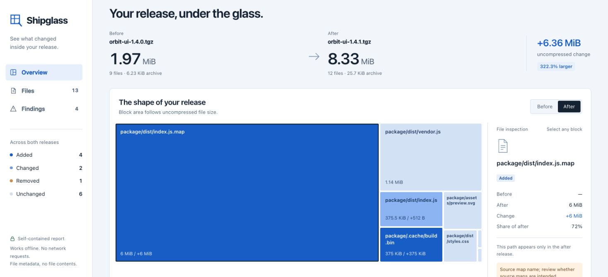

# Shipglass

**See what changed inside your release.**

A tiny code change can ship a surprisingly large package. Shipglass compares two release archives and shows exactly which files were added, removed, changed, or made the package grow.

One command. One interactive HTML report. No server, account, or runtime dependencies.

[](https://mengchar-cmu-f25.github.io/shipglass/)

[Explore the live demo](https://mengchar-cmu-f25.github.io/shipglass/) · [GitHub Marketplace](https://github.com/marketplace/actions/shipglass-release-diff) · [Report a bug](https://github.com/mengchar-cmu-F25/shipglass/issues) · [Roadmap](docs/roadmap.md)

> The demo page includes a synthetic Orbit UI example and real releases from npm and PyPI. Download `docs/demo.html` for an offline copy of the synthetic example, or generate it locally with `shipglass demo`.

## Try it

Requires Python 3.10 or newer. Install the v0.3.2 release wheel; Git is not required:

```sh
uv tool install https://github.com/mengchar-cmu-F25/shipglass/releases/download/v0.3.2/shipglass-0.3.2-py3-none-any.whl
shipglass demo -o report.html
```

Or use pip in your Python environment:

```sh
python -m pip install https://github.com/mengchar-cmu-F25/shipglass/releases/download/v0.3.2/shipglass-0.3.2-py3-none-any.whl
python -m shipglass demo -o report.html
```

Open `report.html` in your browser. The demo is generated locally from synthetic archives; it needs no network connection or sample download after installation.

To try a real release comparison, run `shipglass npm vite 6.0.0 7.0.0 -o vite.html`. This downloads the two public npm archives without installing or executing their contents.

## Explore real releases

Open a report without installing anything, then follow its recipe to reproduce it locally:

| Release archives | Expanded payload change | What the report shows |
| --- | ---: | --- |
| [Vite 6.0.0 → 7.0.0](https://mengchar-cmu-f25.github.io/shipglass/?example=vite) | −536,727 B (−19.1%) | Changed chunk paths and removed CJS files. [Reproduce](docs/examples/vite.md). |
| [Rich 13.9.4 → 14.0.0](https://mengchar-cmu-f25.github.io/shipglass/?example=rich) | +3,846 B (+0.40%) | Seven modified files and versioned wheel metadata. [Reproduce](docs/examples/rich.md). |

These measurements come from the published archives. They describe package contents, not installed dependency size, application bundle size, performance, or compatibility. The linked recipes include source links and exact commands; package contents were never installed or executed.

## Compare what you ship

Compare two published npm versions in one command:

```sh
shipglass npm vite 6.0.0 7.0.0 -o vite.html
```

This explicit download command reads exact versions from the public npm registry, checks the registry's archive digest, and compares them without installing packages or running their scripts. It needs Python, not Node.js or npm. See the [npm guide](docs/npm.md) for scoped packages, limits, and network behavior.

For files already on disk:

```sh
# Compare npm packages
shipglass compare app-1.0.0.tgz app-1.1.0.tgz -o report.html

# Compare Python wheels
shipglass compare dist/app-1.0.0-py3-none-any.whl \
                  dist/app-1.1.0-py3-none-any.whl -o report.html

# Inspect one archive
shipglass inspect dist/app-1.1.0-py3-none-any.whl -o report.html

# Save a machine-readable comparison alongside the report
shipglass compare before.zip after.zip -o report.html --json diff.json

# Add a compact Markdown summary for CI or review
shipglass compare before.zip after.zip -o report.html --markdown summary.md
```

Supported formats: `.zip`, `.whl`, `.tar`, `.tgz`, and `.tar.gz`. Inputs are local archive files. Archive paths are preserved, so files are matched by their paths inside each archive.

Scans allow up to 50,000 archive members, including directories, and 1 GiB each of archive input and expanded payload. Invalid or oversized inputs produce an error.

ZIP and wheel entries must use STORE or DEFLATE compression. ZIP central directories are limited to 64 MiB; ZIP64 central directories, encrypted ZIPs, and other ZIP compression methods are not supported.

The report brings together:

- **Size changes:** compressed archive size, expanded file size, and the files behind the largest changes.
- **A file treemap:** explore where the bytes went and find a large file at a glance.
- **A searchable inventory:** filter added, removed, changed, and unchanged files.
- **Content comparisons:** SHA-256 detects changed file contents even when the byte count stays the same.
- **Packaging cautions:** highlight filenames worth checking before release, such as environment files, private-key-shaped names, and source maps.

A caution asks for a packaging decision. A source map may be intentional; a filename resembling a key does not prove that it contains a credential. Shipglass does not scan file contents for secrets or certify that an archive is safe.

## Use it in CI

To compare two public npm versions without preparing archives, use the [manual npm workflow](docs/npm.md#run-in-github-actions).

After your workflow builds or downloads both archives onto the runner, add:

```yaml
- name: Compare release archives
  uses: mengchar-cmu-F25/shipglass@v0.3.2
  with:
    before: dist/before.tgz
    after: dist/after.tgz
    max-growth-bytes: '1000000' # Optional; expanded payload bytes
```

The Action adds a job summary and uploads the generated HTML, JSON, and Markdown reports as a GitHub artifact. It does not upload the input archives or run their scripts. If a size or warning check fails, the reports are saved before the step fails. Downloading the artifact requires GitHub sign-in.

See the [GitHub Actions guide](docs/github-actions.md) for a complete workflow, inputs, outputs, runner requirements, and report privacy.

For other CI systems, use the CLI:

```sh
shipglass compare before.tgz after.tgz \
  -o report.html --json diff.json --markdown summary.md \
  --fail-on-growth 1000000

shipglass compare before.tgz after.tgz \
  -o report.html --fail-on-warnings
```

Keep the generated reports as CI artifacts for reviewers. `--fail-on-growth` takes a byte count; `--fail-on-warnings` makes packaging cautions fail the check. These are opt-in checks. The CLI writes reports before returning exit code 1 for a failed check; invalid inputs return exit code 2.

Growth is measured as the increase in expanded payload bytes, not compressed archive size. Warnings are checked against the current archive: removing a file with a caution does not fail the check.

### Archives with a wrapper directory

By default, paths are compared exactly as stored in the archive. If both inputs have a wrapper directory, remove one leading path component explicitly:

```sh
shipglass compare app-1.0.tar.gz app-1.1.tar.gz \
  --strip-components 1 -o report.html
```

`--strip-components N` applies to both inputs. It drops entries with too few components, including top-level files when `N` is 1. There is no automatic prefix matching. The same option is available on `inspect`.

### Create an npm archive

To create an npm archive without running lifecycle scripts:

```sh
npm pack --ignore-scripts
```

Build the package first if its published output is normally generated by `prepack` or another lifecycle script. This command packages the files currently on disk. See the [npm pack documentation](https://docs.npmjs.com/cli/v11/commands/npm-pack/).

## Local by design

The `compare`, `inspect`, and `demo` commands run without a network connection. The optional `npm` command downloads the public versions you request into a temporary directory and removes them after comparison. The CLI does not upload archives, execute their contents, or extract their files into your project. HTML reports work offline and contain file paths and metadata, not archived file contents.

The optional GitHub Action uploads the generated reports to GitHub and writes a job summary. Paths and metadata, including content hashes in HTML and JSON, can still reveal private information. Review your workflow's access and retention settings before using it with private archives, and review reports before sharing them.

Shipglass focuses on file-level release changes. It does not compare source code line by line, compare timestamps or permission modes, recursively inspect nested archives, analyze binary compatibility, or treat two differently named paths as a rename. For deep format-aware comparisons, [diffoscope](https://diffoscope.org/) is a complementary tool. See [the project scope and alternatives](docs/positioning.md).

## Contribute

Useful bug reports include a small, synthetic archive that reproduces the problem. Contributions to archive correctness, report usability, and documentation are welcome. Start with [CONTRIBUTING.md](CONTRIBUTING.md).

```sh
git clone https://github.com/mengchar-cmu-F25/shipglass.git
cd shipglass
python -m pip install -e .
python -m unittest discover -s tests -v
```

## 中文

Shipglass 用来查看“这次发布包里到底变了什么”：比较两个本地压缩包，生成可离线打开的交互式 HTML 报告，显示文件增删、内容变化、体积变化和需要检查的文件名。支持 npm tarball、Python wheel、ZIP 和 TAR，无运行时依赖。

`shipglass npm vite 6.0.0 7.0.0 -o vite.html` 可直接下载并比较两个公开 npm 版本，不安装或执行包。该命令需要联网；`compare`、`inspect` 和 `demo` 仍可离线使用。

安装后运行 `shipglass demo -o report.html`，在浏览器中打开报告即可体验。CLI 不会上传文件；可选的 GitHub Action 会将生成的 HTML、JSON 和 Markdown 报告上传为工作流产物，并写入任务摘要。报告包含路径和元数据，分享前请检查是否涉及私有信息。文件名提示不代表已发现漏洞或秘密。

## License

[MIT](LICENSE) © 2026 Mengchao Ren.
